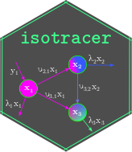

[](https://gitlab.com/matthieu-bruneaux/isotracer/-/commits/master)
[](https://matthieu-bruneaux.gitlab.io/isotracer/coverage/coverage.html)
[](https://matthieu-bruneaux.gitlab.io/isotracer/R-CMD-check_output.txt)
[](https://lifecycle.r-lib.org/articles/stages.html)

isotracer: an R package for the analysis of tracer addition experiments 
=======================================================================

Isotope tracer addition experiments are used to answer a wide variety of biological, ecological and evolutionary questions. In these experiments, a labeled element is injected into a biological system and its fate is traced throughout the system to estimate the flux of matter across compartments. Tracer additions can be used across all levels of biological organization from cells and tissues, to organisms and ecosystems. The **isotracer** package provides tools to analyze data from such experiments.

## How to install the package (stable version)

Installing from the GitLab repository should be as easy as typing:

```
# Run inside an R session
install.packages("devtools")
devtools::install_gitlab("matthieu-bruneaux/isotracer", quiet = TRUE)
```

Next, you can visit the [documentation for the latest stable version](https://matthieu-bruneaux.gitlab.io/isotracer/).

### How to install the development version

If you feel adventurous, you can install the latest development version with:

```
# Run inside an R session
install.packages("devtools")
devtools::install_gitlab("matthieu-bruneaux/isotracer@develop", quiet = TRUE)
```

and visit the [documentation website for the development version](https://matthieu-bruneaux.gitlab.io/isotracer/dev/).

*(Note that the latest development version might containg some maturing features with a changing interface and possibly some bugs!)*

## Where to start?

It's a good idea to have a look at the **Tutorials** to get an idea of how things work. Start with the [Quick Start](https://matthieu-bruneaux.gitlab.io/isotracer/articles/tutorial-010-quick-start.html) tutorial!

## How to cite the package

You can use `citation("isotracer")` to check how to cite isotracer:

> López-Sepulcre A, Bruneaux M, Collins SM, El-Sabaawi R, Flecker AS, Thomas SA (2020). “A new method to reconstruct quantitative food webs and nutrient flows from isotope tracer addition experiments.” _The American Naturalist_, *195*(6), 964-985. doi: 10.1086/708546 (URL: https://doi.org/10.1086/708546).
>
> Bruneaux M, López-Sepulcre A (2021). “isotracer: an R package for the analysis of tracer addition experiments.” doi: 10.1101/2021.08.09.455668 (URL: https://doi.org/10.1101/2021.08.09.455668), (Preprint uploaded to the bioRxiv server).

## Contact

- [Matthieu Bruneaux](mailto:matthieu.bruneaux@gmail.com)
- [Andrés López-Sepulcre](mailto:lopezsepulcre@gmail.com)
