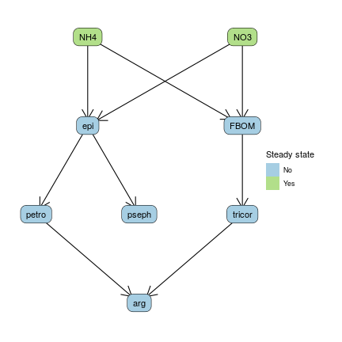
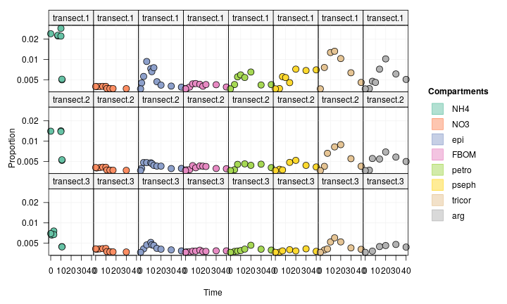
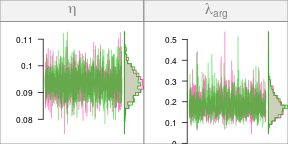
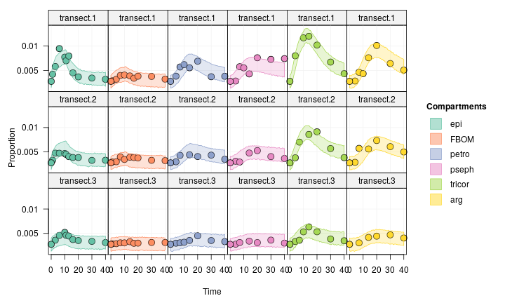
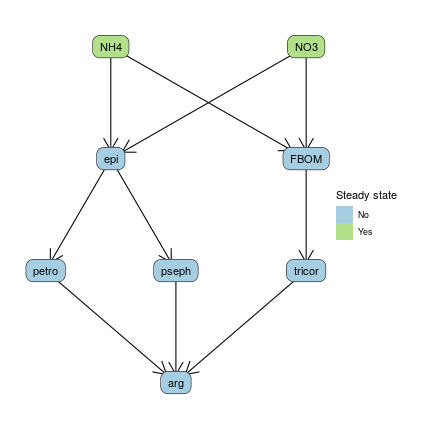
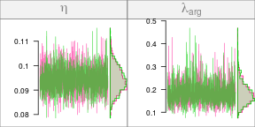
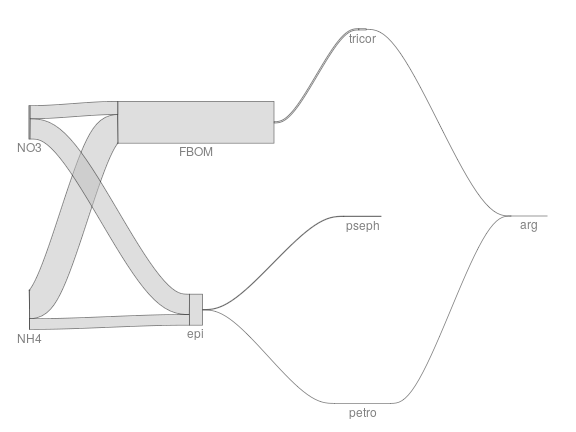
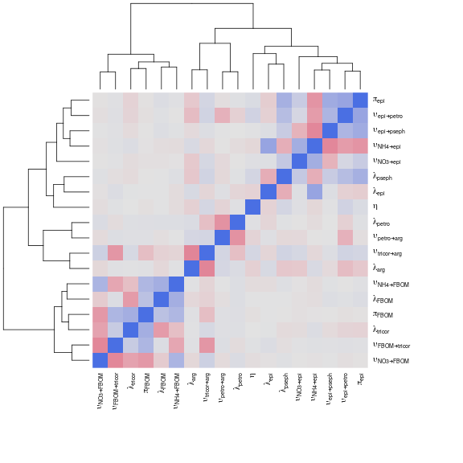

This case study models nitrogen fluxes at the **ecosystem scale** from a dataset collected in Trinidadian mountain streams. The data is taken from the following article: 

- Collins, S. M., S. A. Thomas, T. Heatherly, K. L. MacNeill, A. O.H.C. Leduc, A. López-Sepulcre, B. A. Lamphere, et al. **Fish Introductions and Light Modulate Food Web Fluxes in Tropical Streams: A Whole-Ecosystem Experimental Approach.** Ecology (2016) https://doi.org/10.1002/ecy.1530.

The goal is to quantify the nitrogen exchanges in the stream foodweb, from the dissolved nutrients (NH$_4^+$ and NO$_3^-$) to the top invertebrate predators. Using the **isotracer** package, we can:

- estimate those fluxes and the associated uncertainties
- test for the existence of suspected trophic links between some species of interest.

## Experiment and data


In brief, $^{15}N$-enriched ammonium was dripped in two streams in Trinidad, and samples of the different foodweb compartments were taken during the drip and after the drip in several transects in each stream. The transects were located at different locations downstream of each drip. The drip phase lasted 10 days, and the post-drip phase lasted 30 days. Here is a glimpse of the dataset (we will use only the data from one stream for simplicity, but for a real analysis one could keep both streams and use stream identity as a covariate to estimate the stream effect on flows - see the [case study about eelgrasses](https://matthieu-bruneaux.gitlab.io/isotracer/articles/case-study-mcroy-1970.html) for an example of treatments comparison):


```r
lalaja
```

```
## # A tibble: 223 × 6
##    stream transect   compartment time.days mgN.per.m2  prop15N
##    <chr>  <chr>      <chr>           <dbl>      <dbl>    <dbl>
##  1 UL     transect.1 FBOM                1      5657. NA      
##  2 UL     transect.1 FBOM                1        NA   0.00372
##  3 UL     transect.1 FBOM                4        NA   0.00389
##  4 UL     transect.1 FBOM                7        NA   0.00434
##  5 UL     transect.1 FBOM               10        NA   0.00439
##  6 UL     transect.1 FBOM               14        NA   0.00428
##  7 UL     transect.1 FBOM               17        NA   0.00401
##  8 UL     transect.1 FBOM               20        NA   0.00424
##  9 UL     transect.1 FBOM               30        NA   0.00422
## 10 UL     transect.1 FBOM               40        NA   0.00390
## # … with 213 more rows
```

- `stream` could be one of two locations (`LL` or `UL`), but only data from `UL` is used here.
- `transect` is nested within `stream`, and there are three transects per stream.
- `compartment` is a foodweb compartment.
- `time.days` is the sampling time.
- `mgN.per.m2` is the estimated size of the compartment.
- `prop15N` is the proportion of $^{15}$N in the total nitrogen content of the compartment.

## Building the model

### Network topology

We will only model a simplified version of the foodweb described by Collins et al. to keep the model runtimes short. The foodweb model comprises:

- the two dissolved nutrients (ammonium and nitrate)
- two primary producers (epilithon, the layer of photosynthetic organisms growing on the stream bed, and FBOM, the fine benthic organic matter lying on the stream bed)
- three invertebrate grazers (*Petrophila*, *Psephenus* and *Tricorythodes*). 
- one invertebrate predator (*Argia*), that preys on *Petrophila* and for which we would like to test another potential trophic link with *Psephenus*. We will test this extra trophic link later in the vignette.

We initialize the network model with the corresponding topology:


```r
m <- new_networkModel() %>%
  set_topo("NH4, NO3 -> epi, FBOM", "epi -> petro, pseph", "FBOM -> tricor",
           "petro, tricor -> arg")
```


Since the inorganic nutrients are being constantly renewed by the stream flow, we will consider them in a steady state. We set both NH4 and NO3 to a steady state in the model:


```r
m <- m %>% set_steady(c("NH4", "NO3"))
```

This is how our network look like at this stage:


```r
ggtopo(m, "sugiyama")
```



### Initial conditions and observations

The drip of $^{15}N$-enriched ammonium was started at the very beginning of the experiment, and the initial conditions reflect the enrichment observed for NH4 and NO3 (only ammonium is dripped, but it is converted to nitrate quite rapidly and the experimental setup is thus equivalent to a drip phase for both ions).

The initial conditions are contained in a `tibble`:


```r
inits
```

```
## # A tibble: 24 × 5
## # Groups:   stream, transect [3]
##    stream transect   compartment mgN.per.m2 prop15N
##    <chr>  <chr>      <chr>            <dbl>   <dbl>
##  1 UL     transect.1 NH4              0.300 0.0240 
##  2 UL     transect.1 NO3             31.5   0.00397
##  3 UL     transect.2 NH4              0.300 0.0140 
##  4 UL     transect.2 NO3             31.5   0.00407
##  5 UL     transect.3 NH4              0.300 0.00694
##  6 UL     transect.3 NO3             31.5   0.00413
##  7 UL     transect.1 arg              2.31  0.00366
##  8 UL     transect.2 arg              2.31  0.00366
##  9 UL     transect.3 arg              2.31  0.00366
## 10 UL     transect.1 epi            329.    0.00366
## # … with 14 more rows
```

We add them to the model, specifying the grouping variable (`transect`, each transect being a different location downstream the drip station in the `UL` stream):


```r
m <- m %>% set_init(inits, comp = "compartment", size = "mgN.per.m2", prop = "prop15N",
                    group_by = c("transect"))
```

The replication structure of the model can be examined using the `groups()` function:


```r
groups(m)
```

```
## # A tibble: 3 × 1
##   transect  
##   <chr>     
## 1 transect.1
## 2 transect.2
## 3 transect.3
```

The next step is to add the observations made during the experiment:


```r
m <- m %>% set_obs(trini, time = "time.days")
```

The enrichment data can be visualized with the `plot()` method:


```r
# Note the log scale for better visualization
plot(m, facet_row = "group", facet_col = "compartment", type = "prop",
     scale = "all", log = TRUE,
     comps = c("NH4", "NO3", "epi", "FBOM", "petro", "pseph", "tricor", "arg"))
```



Interestingly, we see that one of the consumer, `tricor`, is over-enriched compared to its resources (`epi` and `FBOM`). This is due to the "bulk" nature of the epilithon and FBOM compartments.

### Allowing for inhomogeneous compartments

Some compartment are sampled "in bulk" by the field scientist, but are really comprised of several sub-compartments, which can independently incorporate the marked tracer or be selectively fed upon by a consumer at the time scale of the experiment. For example, "epilithon" is really everything that we can be scratch and collect from the surface of a stream bed rock in the field, but it might actually be composed of an active fraction incorporating the dissolved nutrients (algae growing on the rock) and being selectively grazed by the invertebrate consumers, while the rest is a refractory fraction of sediment and debris which are not involved in the nutrient cycle at the scale of a few days.

To account for that in our model, we can allow for epilithon and FBOM to be split compartments with an active and a refractory portions:


```r
m <- m %>% set_split(c("epi", "FBOM"))
```

For `epi` (and similarly for `FBOM`), this introduces a new parameter, `portion.act_epi`, which is used to split the initial biomass for the `epi` compartment into an active portion (involved in the network) and a refractory portion (isolated from the network, but used to predict observed size and proportion marked in the "bulk" epilithon).

### Drip regime

The NH4 and NO3 quantities during the "on" phase of the drip (when the experiment starts) are already defined by (i) the fact that we set ammonium and nitrate to be in a steady state and (ii) the initial conditions. We will specify the quantities for the "off" phase by using the `add_pulse_event()` function to decrease the amount of $^{15}N$ in the ammomiun and nitrate compartments after day 10.

The `add_pulse_event()` function accepts either a single pulse specification, or bulk pulses defined in a table. We use the table syntax here:


```r
pulses <- tribble(
  ~ stream,    ~ transect, ~ comp, ~ time, ~ qty_14N, ~ qty_15N,
      "UL",  "transect.1",  "NH4",     11,         0,  -0.00569,
      "UL",  "transect.2",  "NH4",     11,         0,  -0.00264,
      "UL",  "transect.3",  "NH4",     11,         0, -0.000726,
      "UL",  "transect.1",  "NO3",     11,         0,  -0.00851,
      "UL",  "transect.2",  "NO3",     11,         0,  -0.01118,
      "UL",  "transect.3",  "NO3",     11,         0,  -0.01244,
  )
```


```r
m <- m %>% add_pulse_event(pulses = pulses, comp = "comp", time = "time",
                           unmarked = "qty_14N", marked = "qty_15N")
```

### Setting the distribution family for observed sizes

Let's think a moment about the modelling of the observed compartment sizes. By default, the `isotracer` model assumes that observed compartment pool sizes are distributed following a normal distribution around the values expected from the calculated trajectories, with a coefficient of variation $\zeta$ shared by all compartments. This is fine when the compartments exhibit similar variation in their biomasses, but in the case of this ecosystem study they do not.

To illustrate this point, let's calculate the standard deviations and the corresponding coefficients of variation for the observed compartment sizes:


```r
trini %>% select(compartment, mgN.per.m2) %>%
  na.omit() %>%
  group_by(compartment) %>%
  summarize(mean = mean(mgN.per.m2),
            sd = sd(mgN.per.m2),
            cv = sd / mean) %>%
  arrange(cv)
```

```
## # A tibble: 8 × 4
##   compartment     mean      sd    cv
##   <chr>          <dbl>   <dbl> <dbl>
## 1 NH4            0.300    0    0    
## 2 NO3           31.5      0    0    
## 3 epi          329.     115.   0.350
## 4 FBOM        5267.    2436.   0.463
## 5 pseph         14.4     10.7  0.745
## 6 arg            2.31     2.88 1.25 
## 7 tricor         8.38    13.3  1.59 
## 8 petro          1.40     2.48 1.77
```

The coefficients of variation are particularly large for the invertebrates, which is due to the patchiness of their distribution on the stream bed.

One way to handle this in our model is to allow for $\zeta$ to be compartment-specific. To make things easier for the model fit here, we will actually provide those compartment-specific $\zeta$ values as fixed parameters, but we could also let the model estimate them.

First, we specify that $\zeta$ depends on the compartment, and that it represents the standard deviation of the distributions:


```r
m <- m %>% set_size_family("normal_sd", by_compartment = TRUE)
```

Then, we provide constant priors for those parameters based on the values calculated above:


```r
m <- set_prior(m, constant(0.1), "zeta_NH4") %>%  # Dummy values for the steady
  set_prior(constant(0.1), "zeta_NO3") %>%        # state dissolved nutrients
  set_prior(constant(115), "zeta_epi") %>%
  set_prior(constant(2436), "zeta_FBOM") %>%
  set_prior(constant(10.7), "zeta_pseph") %>%
  set_prior(constant(2.88), "zeta_arg") %>%
  set_prior(constant(13.3), "zeta_tricor") %>%
  set_prior(constant(2.48), "zeta_petro")
```

## Running the model

### Setting priors

Before we run the model, let's have a look at the default priors used for the other parameters:


```r
priors(m) %>% filter(!startsWith(in_model, "zeta"))
```

```
## # A tibble: 20 × 2
##    in_model               prior                  
##    <chr>                  <list>                 
##  1 eta                    <hcauchy (scale=0.1)>  
##  2 lambda_arg             <hcauchy (scale=0.1)>  
##  3 lambda_epi             <hcauchy (scale=0.1)>  
##  4 lambda_FBOM            <hcauchy (scale=0.1)>  
##  5 lambda_NH4             <hcauchy (scale=0.1)>  
##  6 lambda_NO3             <hcauchy (scale=0.1)>  
##  7 lambda_petro           <hcauchy (scale=0.1)>  
##  8 lambda_pseph           <hcauchy (scale=0.1)>  
##  9 lambda_tricor          <hcauchy (scale=0.1)>  
## 10 portion.act_epi        <uniform (min=0,max=1)>
## 11 portion.act_FBOM       <uniform (min=0,max=1)>
## 12 upsilon_epi_to_petro   <hcauchy (scale=0.1)>  
## 13 upsilon_epi_to_pseph   <hcauchy (scale=0.1)>  
## 14 upsilon_FBOM_to_tricor <hcauchy (scale=0.1)>  
## 15 upsilon_NH4_to_epi     <hcauchy (scale=0.1)>  
## 16 upsilon_NH4_to_FBOM    <hcauchy (scale=0.1)>  
## 17 upsilon_NO3_to_epi     <hcauchy (scale=0.1)>  
## 18 upsilon_NO3_to_FBOM    <hcauchy (scale=0.1)>  
## 19 upsilon_petro_to_arg   <hcauchy (scale=0.1)>  
## 20 upsilon_tricor_to_arg  <hcauchy (scale=0.1)>
```

Those default priors have to be adjusted to the data being modeled. Here, the time units are days, and so a half-Cauchy prior with a median of 0.1 means that the prior for the uptake rates and loss rates has a median equivalent to 10% of the N content of a given compartment being uptaken or lost in a day. This is reasonable for biological compartments, but it is too restrictive for dissolved nutrients: those are being constantly renewed by the stream flow, so we can expect much higher daily uptake rates from those.

Below we modify the priors for the uptakes from dissolved nutrients to allow for such higer daily uptake rates. In addtion, we also set their loss rate to a constant dummy value: since those compartments are in a steady state, we don't need the sampler to sample their loss rate.


```r
m <- m %>%
  set_prior(hcauchy(5), "upsilon_N") %>%
  set_prior(constant(0), "lambda_N")
```

### Running the model

We are ready to run the model fit:


```r
run <- run_mcmc(m, iter = 2000)
plot(run)
# Note: the figure below only shows a few of the traceplots for vignette concision
```



### Posterior predictive fits

Once the fit is completed (and provided that no issues arised during the Stan run), we can calculate the posterior predicted trajectories and check if they match with the observed data:


```r
pred <- predict(m, run, draws = 200)
```


```r
plot(pred, facet_row = "group", facet_col = "compartment", type = "prop",
     scale = "all", log = TRUE,
     comps = c("epi", "FBOM", "petro", "pseph", "tricor", "arg"))
```



The quality of the fit looks quite good. We could use this fit to estimate flows between compartments and make quantitative conclusions from those results. We can also use this model as a base model to test for putative trophic link.

For example, one putative link is that *Argia* might feed on *Psephenus* in addition to feeding on *Petrophila* and *Tricorythodes*. We can build an run an alternative model with this link, and compare the two models.

## Alternative model

The data used for this alternative model is the same, only the topology of the model is changed:


```r
m2 <- m %>% set_topo("NH4, NO3 -> epi, FBOM", "epi -> petro, pseph",
                     "FBOM -> tricor", "petro, pseph, tricor -> arg")
```

Changing the topology resets steady and split compartments and priors. Let's apply the same settings as for the first model:


```r
m2 <- m2 %>%
  set_steady(c("NH4", "NO3")) %>%
  set_split(c("epi", "FBOM")) %>%
  set_prior(constant(0.1), "zeta_NH4") %>%
  set_prior(constant(0.1), "zeta_NO3") %>%   
  set_prior(constant(115), "zeta_epi") %>%
  set_prior(constant(2436), "zeta_FBOM") %>%
  set_prior(constant(10.7), "zeta_pseph") %>%
  set_prior(constant(2.88), "zeta_arg") %>%
  set_prior(constant(13.3), "zeta_tricor") %>%
  set_prior(constant(2.48), "zeta_petro") %>%
  set_prior(hcauchy(5), "upsilon_N") %>%
  set_prior(constant(0), "lambda_N")
```

The structure of this alternative model is:


```r
ggtopo(m2, "sugiyama")
```



We run the model:


```r
run2 <- run_mcmc(m2, iter = 2000)
plot(run2)
# Note: the figure below only shows a few of the traceplots for vignette concision
```



We check the model fit with a posterior predictive fit:


```r
pred2 <- predict(m2, run2, draws = 200)
```


```r
plot(pred2, facet_row = "group", facet_col = "compartment", type = "prop",
     scale = "all", log = TRUE,
     comps = c("epi", "FBOM", "petro", "pseph", "tricor", "arg"))
```


When comparing with the first fit, this one looks equally good as before. Which model should we prefer?

## Model comparison

We compare the two models by calculating their DIC and choosing the model with the lowest DIC.

Note that the use of DIC is not ideal here: DIC is valid when the posteriors have a multinormal distribution, which is not the case here givn that the parameters are bounded by zero and several exhibit skewness.

An alternative to DIC is to use LOO (leave-one-out validation). However, LOO requires independent data, and the data used here is a time series where data points are not independent. 


We use the `dic()` function to calculate the model DIC values and the corresponding DIC weight:


```r
dic(run, run2)
```

```
## # A tibble: 2 × 6
##   fit     Dbar    pD    DIC delta_DIC weight
##   <chr>  <dbl> <dbl>  <dbl>     <dbl>  <dbl>
## 1 run   -1822.  20.7 -1801.      0    0.928 
## 2 run2  -1819.  23.4 -1796.      5.13 0.0716
```

`run` is from the model fit without the trophic link `pseph -> arg`. According to the DIC, this model is slightly more likely than the alternative model with the extra trophic link. The evidence is not very strong though, as evidenced by the small $\Delta$DIC value and the DIC weights.

## Sankey plot

Let's estimate the flows between compartments. Since this network has steady state sources, we can estimate flows at equilibrium:


```r
flows <- tidy_flows(m, run, n = 500, steady_state = TRUE)
```


Sankey plot:


```r
f <- flows %>%
  select(flows) %>%
  unnest(flows) %>%
  na.omit() %>% # We drop the rows corresponding to `lambda` losses
  group_by(from, to) %>%
  summarize(flow = mean(average_flow),
            sd = sd(average_flow),
            cv = sd / flow)
```

```
## `summarise()` has grouped output by 'from'. You can override using the `.groups` argument.
```

```r
nodes <- inits %>%
  ungroup() %>%
  filter(transect == "transect.1") %>%
  select(comp = compartment, size = mgN.per.m2) %>%
  mutate(label = comp)
sankey(topo(m), nodes, f %>% select(from, to, flow) %>% rename(width = flow),
       edge_f = 0.2, layout = "left2right")
```



## To go further

A heatmap of the correlation between parameter estimates can be a good way to visualize the strength of the interdependence between parameters:


```r
mcmc_heatmap(run)
```


