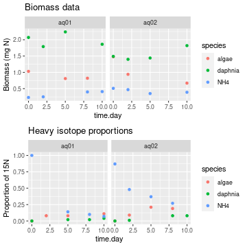
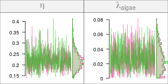

## Introduction

In the [Quick Start tutorial](tutorial-010-quick-start.html), we modelled an experiment which took place in only **one aquarium**. In this tutorial, we are going to model a foodweb using data from **two aquariums**, and use each of those aquariums as a **replication unit**.

It is important to note that in this example, the replication units share the **same foodweb topology** and the **same model parameter values** (i.e. uptake rates and loss rates). They are really just that: replication units. The only thing that will be different between them are the initial conditions and the observations.

We keep the foodweb model of this example simple, with only three compartments as before:

- dissolved ammonium NH$_4^+$ (`NH4`), which is enriched in $^{15}$N at the
  beginning of the experiment
- planctonic algae which incorporate NH$_4^+$ (`algae`)
- *Daphnia* which graze on algae and excrete ammonium into the water.

Let's get started!


```r
library(isotracer)
library(tidyverse)
```

## Data preparation

The simulated data we use in this example can be loaded into your R session by running the code below:


```r
exp <- tibble::tribble(
  ~time.day,  ~species, ~biomass, ~prop15N, ~aquariumID,
          0,   "algae",     1.03,        0,      "aq01",
          2,   "algae",       NA,     0.08,      "aq01",
          5,   "algae",     0.81,     0.08,      "aq01",
          8,   "algae",     0.82,       NA,      "aq01",
         10,   "algae",       NA,     0.11,      "aq01",
          0, "daphnia",     2.07,        0,      "aq01",
          2, "daphnia",     1.79,       NA,      "aq01",
          5, "daphnia",     2.24,     0.02,      "aq01",
          8, "daphnia",       NA,     0.02,      "aq01",
         10, "daphnia",     1.86,     0.04,      "aq01",
          0,     "NH4",     0.23,        1,      "aq01",
          2,     "NH4",     0.25,       NA,      "aq01",
          5,     "NH4",       NA,     0.14,      "aq01",
          8,     "NH4",      0.4,      0.1,      "aq01",
         10,     "NH4",     0.41,     0.07,      "aq01",
          0,   "algae",     1.48,        0,      "aq02",
          2,   "algae",     0.94,     0.09,      "aq02",
          5,   "algae",       NA,     0.21,      "aq02",
          8,   "algae",       NA,     0.19,      "aq02",
         10,   "algae",     0.67,       NA,      "aq02",
          0, "daphnia",     1.49,        0,      "aq02",
          2, "daphnia",      1.4,     0.01,      "aq02",
          5, "daphnia",     1.44,       NA,      "aq02",
          8, "daphnia",       NA,     0.08,      "aq02",
         10, "daphnia",     1.82,     0.08,      "aq02",
          0,     "NH4",     0.51,     0.87,      "aq02",
          2,     "NH4",     0.47,     0.48,      "aq02",
          5,     "NH4",     0.35,     0.37,      "aq02",
          8,     "NH4",       NA,     0.27,      "aq02",
         10,     "NH4",     0.39,       NA,      "aq02"
  )
```

As you can see in this table, the data contains the total amount of nitrogen (`biomass`) and the proportion of $^{15}$N in this nitrogen (`prop15N`) for each compartment (`species`) at different time points, in two different aquariums (`aquariumID`).

We can visualize the data using `ggplot2`:


```r
library(ggplot2)
library(gridExtra)
p1 <- ggplot(exp, aes(x = time.day, y = biomass, col = species)) +
    geom_point() + ggtitle("Biomass data") + ylab("Biomass (mg N)") +
    facet_wrap(~ aquariumID)
p2 <- ggplot(exp, aes(x = time.day, y = prop15N, col = species)) +
    geom_point() + ggtitle("Heavy isotope proportions") + ylab("Proportion of 15N")  +
    facet_wrap(~ aquariumID)
grid.arrange(p1, p2, nrow = 2)
```



### Building the network model

As in the [Quick Start](tutorial-010-quick-start.html) tutorial, we start by creating an empty network model to which we add a network topology:


```r
m <- new_networkModel() %>% set_topo("NH4 -> algae -> daphnia -> NH4")
m
```

```
## # A tibble: 1 × 4
##   topology           initial observations parameters      
##   <list>             <list>  <list>       <list>          
## 1 <topology [3 × 3]> <NULL>  <NULL>       <tibble [8 × 2]>
```

For now, the model just contains the topology (and the list of parameters to be estimated by MCMC, which was added automatically).

Let's add the initial conditions for both aquaria. We can get them by extracting the data from the `exp` table at $t_0$:


```r
inits <- exp %>% filter(time.day == 0)
inits
```

```
## # A tibble: 6 × 5
##   time.day species biomass prop15N aquariumID
##      <dbl> <chr>     <dbl>   <dbl> <chr>     
## 1        0 algae      1.03    0    aq01      
## 2        0 daphnia    2.07    0    aq01      
## 3        0 NH4        0.23    1    aq01      
## 4        0 algae      1.48    0    aq02      
## 5        0 daphnia    1.49    0    aq02      
## 6        0 NH4        0.51    0.87 aq02
```

We add them to the model using `set_init()` as in the previous tutorial, but note how we use `group_by = "aquariumID"` to indicate that we have initial conditions for different replicates:


```r
m <- m %>% set_init(inits, comp = "species", size = "biomass", prop = "prop15N",
                    group_by = "aquariumID")
```

Let's have a look at our model at this stage:


```r
m
```

```
## # A tibble: 2 × 5
##   topology           initial          observations parameters       group    
##   <list>             <list>           <list>       <list>           <list>   
## 1 <topology [3 × 3]> <tibble [3 × 3]> <NULL>       <tibble [8 × 2]> <chr [1]>
## 2 <topology [3 × 3]> <tibble [3 × 3]> <NULL>       <tibble [8 × 2]> <chr [1]>
```

We now have two rows in the model table: each row corresponds to one replicate. The `initial` column has been populated with the appropriate initial conditions for each replicate and the network topology has been duplicated as many times as needed. The `group` column now contains the grouping variables defining the replicates, and the grouping structure can be quickly accessed with the `groups()` function:


```r
groups(m)
```

```
## # A tibble: 2 × 1
##   aquariumID
##   <chr>     
## 1 aq01      
## 2 aq02
```

In this case we have only one grouping variable (`aquariumID`), but we could have more (for example some experimental treatments such as temperature or oxygen manipulation).

The final step of the model preparation is to add the observations. Let's extract them from the `exp` table, keeping only rows after $t_0$:


```r
obs <- exp %>% filter(time.day > 0)
obs
```

```
## # A tibble: 24 × 5
##    time.day species biomass prop15N aquariumID
##       <dbl> <chr>     <dbl>   <dbl> <chr>     
##  1        2 algae     NA       0.08 aq01      
##  2        5 algae      0.81    0.08 aq01      
##  3        8 algae      0.82   NA    aq01      
##  4       10 algae     NA       0.11 aq01      
##  5        2 daphnia    1.79   NA    aq01      
##  6        5 daphnia    2.24    0.02 aq01      
##  7        8 daphnia   NA       0.02 aq01      
##  8       10 daphnia    1.86    0.04 aq01      
##  9        2 NH4        0.25   NA    aq01      
## 10        5 NH4       NA       0.14 aq01      
## # … with 14 more rows
```

We add them to the model with `add_obs()` (note how the same `group_by` argument as the one used with `set_init()` is used by default):


```r
m <- m %>% set_obs(obs, time = "time.day")
m
```

```
## # A tibble: 2 × 5
##   topology           initial          observations      parameters       group    
##   <list>             <list>           <list>            <list>           <list>   
## 1 <topology [3 × 3]> <tibble [3 × 3]> <tibble [12 × 4]> <tibble [8 × 2]> <chr [1]>
## 2 <topology [3 × 3]> <tibble [3 × 3]> <tibble [12 × 4]> <tibble [8 × 2]> <chr [1]>
```

Perfect! Now the model is ready to be run with the MCMC sampler.

## Running the MCMC

Let's have a look at the model parameters that are going to be estimated during the MCMC run and their default priors:


```r
priors(m)
```

```
## # A tibble: 8 × 2
##   in_model                 prior                
##   <chr>                    <list>               
## 1 eta                      <hcauchy (scale=0.1)>
## 2 lambda_algae             <hcauchy (scale=0.1)>
## 3 lambda_daphnia           <hcauchy (scale=0.1)>
## 4 lambda_NH4               <hcauchy (scale=0.1)>
## 5 upsilon_algae_to_daphnia <hcauchy (scale=0.1)>
## 6 upsilon_daphnia_to_NH4   <hcauchy (scale=0.1)>
## 7 upsilon_NH4_to_algae     <hcauchy (scale=0.1)>
## 8 zeta                     <hcauchy (scale=0.1)>
```

Those priors will be good enough for the tutorial. Note that even though we have two experimental replicates in our dataset, they share the same parameter values in our model. We will learn later how to specify some **covariates** for the parameter estimates (for example when we want to test if a parameter is different between two experimental treatments).

Let's run the MCMC sampler:


```r
run <- run_mcmc(m, iter = 1000)
plot(run)
# Note: the figure below only shows a few of the traceplots for vignette concision
```



The traces look nice. If we want to check numerically that the convergence is good, we can use the `coda::gelman.diag()` function:


```r
coda::gelman.diag(run)
```

```
## Potential scale reduction factors:
## 
##                          Point est. Upper C.I.
## eta                           1.016       1.04
## lambda_algae                  1.002       1.01
## lambda_daphnia                0.999       1.00
## lambda_NH4                    1.003       1.02
## upsilon_algae_to_daphnia      1.002       1.01
## upsilon_daphnia_to_NH4        1.004       1.02
## upsilon_NH4_to_algae          0.999       1.00
## zeta                          1.003       1.00
## 
## Multivariate psrf
## 
## 1.01
```

All the diagnostic estimates are very close to one, so we can proceed. Let's have a look at the **posterior predictive check** to see if our model is consistent with the observations:


```r
predictions <- predict(m, run)
plot(predictions, facet_row = "group")
```


This looks nice! As far as we can tell, our model is compatible with the observed data.

## To go further

At this stage you know how to include several replicates in a network model. In a later tutorial, you'll see how to use this approach to add fixed effects of covariates on model parameters and how to perform model selection.

The next tutorial will teach you how to set some compartments to a **steady state**, which is useful when some compartments in the foodweb are being constantly renewed (e.g. dissolved inorganic nutrients in a river).

<nav aria-label="Page navigation">
 <ul class="pagination justify-content-end">
  <li class="page-item"><a class="page-link" href="tutorial-010-quick-start.html">Previous: Quick Start</a></li>
  <li class="page-item"><a class="page-link" href="tutorial-030-steady-state-comps.html">Next: Fixed effects and model selection</a></li>
 </ul>
</nav>


