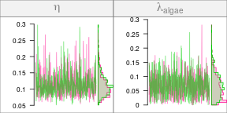
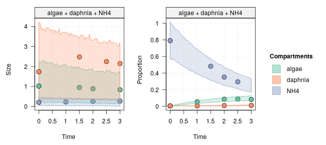
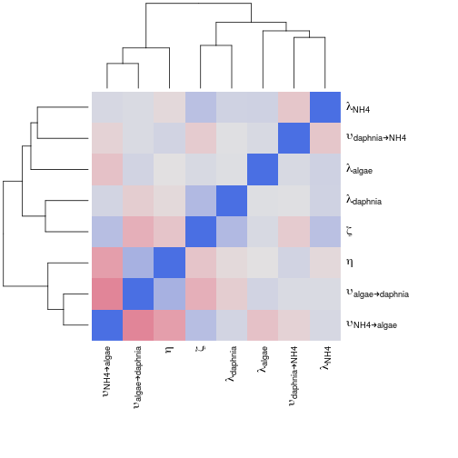

In this tutorial, we assume that you successfully ran an MCMC on a network
model, and that it is now time to have a critical look at the output of the
run.

This tutorial will present how to check that the MCMC run went fine, but it will explain only very briefly how to check that the model is compatible with the observed data. More details about this important step is presented in the next vignette about [posterior predictive checks](tutorial-100-posterior-predictive-checks.html).

This vignette is using the MCMC run from the [Quick start
tutorial](tutorial-010-quick-start.html). Please go back and run the code of
that vignette to generate the MCMC data if you haven't already!


### Reminder: what is the result format returned by `run_mcmc()`?

<div class="alert-primary" role="alert"> 

<b>Note:</b> This short section is a quick reminder of what you learnt in the previous tutorial [MCMC output format](tutorial-080-mcmc-output-format.html)).

</div>

In the **Quick Start** tutorial, we generated the `run` object by running `run <- run_mcmc(m, iter = 1000)`. The output from `run_mcmc()` is a well-behaved
`mcmc.list` object as implemented in the `coda` package:


```r
is(run, "mcmc.list")
```

```
## [1] TRUE
```

It makes it very easy to use the tools already available for this class of
objects, such as those implemented in the packages `coda`, `bayesplot`,
`ggmcmc` or `MCMCvis`.

In addition to all those existing tools, the `isotracer` package also adds some
extra methods to easily calculate derived parameters from an `mcmc.list`. You
will learn more about how to do this in the vignette [Derived
parameters](tutorial-110-derived-parameters.html).

<div class="alert-primary" role="alert"> 

<b>Tip:</b> `isotracer` uses Stan behind the scenes to run the MCMC. If you prefer to get the raw `stanfit` object instead of the processed `mcmc.list`, you can set `stanfit = TRUE` when you run the model:


```r
run <- run_mcmc(model = m, stanfit = TRUE)
```

This might be especially useful if the MCMC sampling is difficult for your
model and you need the `stanfit` object to perform some in-depth diagnostics.

</div>

## General diagnostics

### Trace plot

You should always run **several chains** when performing a Bayesian MCMC. Trace
plots allow to get a feeling for:

- Chain convergence: did all chains reach the same region of the parameter
  space?
- Mixing: is the mixing of good quality or should we modify the sampler
  settings?

If you are not satisfied with the traces, you need to run a longer run or maybe
to tweak the settings of the Stan run.

This is the trace plot we obtained from the previous vignette:


```r
plot(run)
# Note: the figure below only shows a few of the traceplots for vignette concision
```



In this case, the chains have converged towards the same region, and the mixing
looks good for all of them. There is no obvious problem visible in those traces.

### Gelman and Rubin's convergence diagnostic

It can be useful to have a more formal test of the convergence of the
chains. The Gelman and Rubin's convergence diagnostic is implemented in the
`coda` package. We can run it with the `coda::gelman.diag()` function. See the
coda documentation `?gelman.diag` for more details about this diagnostic.

Let's have a look at the diagnostic for our chains:


```r
library(coda)
run %>% gelman.diag()
```

```
## Potential scale reduction factors:
## 
##                          Point est. Upper C.I.
## eta                            1.01       1.02
## lambda_algae                   1.01       1.02
## lambda_daphnia                 1.04       1.08
## lambda_NH4                     1.02       1.04
## upsilon_algae_to_daphnia       1.00       1.01
## upsilon_daphnia_to_NH4         1.01       1.02
## upsilon_NH4_to_algae           1.02       1.05
## zeta                           1.07       1.13
## 
## Multivariate psrf
## 
## 1.02
```

The diagnostic values should be very, very close to 1: it looks good in this
case!

If some values were e.g. $>1.05$, this would already be enough to cause us to
wonder about the sampling quality.

### Predicted trajectories

In order to check the quality of the model fit, the consistency between the parameter posteriors and the observed data can be checked by plotting the credible envelopes for the estimated trajectories along with the observed data points. This is called a posterior predictive check and is very important to check that the model can actually predict the observed data reasonably well. If the observed data cannot be satisfactorily predicted from the fitted model, then our model is not a good model of the data!

To do a posterior predictive check, the first step is to generate predictions for the model based on the MCMC posteriors with `predict()`:


```r
# From the Quick Start tutorial:
# 'm' is the network model we used when calling 'run <- run_mcmc(m, iter = 1000)'
predictions <- predict(m, run, probs = 0.95)
```


We can then visualize the predictions along with the observations with the `plot()` method:


```r
plot(predictions)
```



This plot enables to compare both the **size** and the **proportion** observations with the predictions.

## Post-run analyses

### Parameter estimates

The quickest way to get parameter estimates is to use the `summary()` function
on the posterior:


```r
run %>% summary()
```

```
## 
## Iterations = 501:1000
## Thinning interval = 1 
## Number of chains = 4 
## Sample size per chain = 500 
## 
## 1. Empirical mean and standard deviation for each variable,
##    plus standard error of the mean:
## 
##                             Mean       SD  Naive SE Time-series SE
## eta                      0.12573 0.045522 0.0010179      0.0018643
## lambda_algae             0.10878 0.070078 0.0015670      0.0030039
## lambda_daphnia           0.04093 0.050510 0.0011294      0.0044198
## lambda_NH4               0.10400 0.088347 0.0019755      0.0083902
## upsilon_algae_to_daphnia 0.07696 0.023657 0.0005290      0.0009251
## upsilon_daphnia_to_NH4   0.04791 0.007666 0.0001714      0.0004459
## upsilon_NH4_to_algae     0.34840 0.052415 0.0011720      0.0043206
## zeta                     0.49562 0.367272 0.0082125      0.0422681
## 
## 2. Quantiles for each variable:
## 
##                               2.5%      25%     50%     75%  97.5%
## eta                      0.0667917 0.093090 0.11570 0.14716 0.2358
## lambda_algae             0.0095706 0.057380 0.09819 0.14692 0.2739
## lambda_daphnia           0.0008274 0.009586 0.02448 0.05098 0.2023
## lambda_NH4               0.0032810 0.040996 0.08102 0.13886 0.3512
## upsilon_algae_to_daphnia 0.0429389 0.061367 0.07276 0.08723 0.1380
## upsilon_daphnia_to_NH4   0.0327853 0.042937 0.04791 0.05294 0.0631
## upsilon_NH4_to_algae     0.2620082 0.314227 0.34358 0.37368 0.4886
## zeta                     0.1920546 0.293008 0.38492 0.53885 1.7577
```

If you need to store those values, for example to plot them, you can assign the
output of `summary()` to an object:


```r
estimates <- run %>% summary()
names(estimates)
```

```
## [1] "statistics" "quantiles"  "start"      "end"        "thin"       "nchain"
```

The means and standard deviations are accessible in `$statistics`:


```r
estimates$statistics
```

```
##                                Mean         SD     Naive SE Time-series SE
## eta                      0.12572985 0.04552161 0.0010178942   0.0018643419
## lambda_algae             0.10877678 0.07007833 0.0015669991   0.0030039488
## lambda_daphnia           0.04093240 0.05051013 0.0011294409   0.0044197678
## lambda_NH4               0.10400109 0.08834744 0.0019755088   0.0083902203
## upsilon_algae_to_daphnia 0.07696265 0.02365698 0.0005289861   0.0009250571
## upsilon_daphnia_to_NH4   0.04790965 0.00766557 0.0001714074   0.0004459076
## upsilon_NH4_to_algae     0.34840279 0.05241542 0.0011720443   0.0043206368
## zeta                     0.49562012 0.36727200 0.0082124515   0.0422680948
```

and the quantiles are in `$quantiles`:


```r
estimates$quantiles
```

```
##                                  2.5%         25%        50%        75%     97.5%
## eta                      0.0667916841 0.093089938 0.11570278 0.14715530 0.2357695
## lambda_algae             0.0095706038 0.057380261 0.09818722 0.14692065 0.2738614
## lambda_daphnia           0.0008274279 0.009585545 0.02448287 0.05097507 0.2022906
## lambda_NH4               0.0032809756 0.040996223 0.08102318 0.13885777 0.3512198
## upsilon_algae_to_daphnia 0.0429389313 0.061367259 0.07275507 0.08722961 0.1379669
## upsilon_daphnia_to_NH4   0.0327852929 0.042937383 0.04791171 0.05293982 0.0631050
## upsilon_NH4_to_algae     0.2620082105 0.314226686 0.34358421 0.37368406 0.4886125
## zeta                     0.1920545718 0.293007952 0.38492103 0.53885074 1.7576997
```

### Parameter correlations

The dependencies between your model parameters might be of interest to you. If
you would like to analyse the correlations between parameters during the MCMC
run, you can use a few ready-made functions to get a quick overview of the
correlation structure.

The `isotracer` package comes with the minimalist function `mcmc_heatmap()` to
draw the strength of parameter correlations:


```r
mcmc_heatmap(run)
```



But of course you could use other functions provided by other packages, such as:

- `ggmcmc` package
    + `ggs_crosscorrelation()`
    + `ggs_pairs()`
- `bayesplot` package
    + `mcmc_pairs()`

### Extracting parameters, trajectories and flows

If you are interested in getting detailed tables containing all the samples of the parameter posteriors, you can use the `tidy_mcmc()` function:


```r
tidy_mcmc(run)
```

```
## # A tibble: 2,000 × 3
##    mcmc.chain mcmc.iteration mcmc.parameters
##         <int>          <int> <list>         
##  1          1              1 <dbl [8]>      
##  2          1              2 <dbl [8]>      
##  3          1              3 <dbl [8]>      
##  4          1              4 <dbl [8]>      
##  5          1              5 <dbl [8]>      
##  6          1              6 <dbl [8]>      
##  7          1              7 <dbl [8]>      
##  8          1              8 <dbl [8]>      
##  9          1              9 <dbl [8]>      
## 10          1             10 <dbl [8]>      
## # … with 1,990 more rows
```

By default the parameter values are nested into a list column, but you can also get a flat table with `spread = TRUE`:


```r
tidy_mcmc(run, spread = TRUE)
```

```
## # A tibble: 2,000 × 10
##    mcmc.chain mcmc.iteration   eta lambda_algae lambda_daphnia lambda_NH4
##         <int>          <int> <dbl>        <dbl>          <dbl>      <dbl>
##  1          1              1 0.220       0.0283        0.00717     0.0289
##  2          1              2 0.171       0.131         0.00976     0.131 
##  3          1              3 0.142       0.0612        0.00407     0.0273
##  4          1              4 0.245       0.0671        0.0290      0.0762
##  5          1              5 0.195       0.303         0.0147      0.0481
##  6          1              6 0.216       0.110         0.00465     0.107 
##  7          1              7 0.104       0.0951        0.0132      0.0801
##  8          1              8 0.156       0.0816        0.0420      0.0616
##  9          1              9 0.176       0.0790        0.0428      0.0416
## 10          1             10 0.115       0.198         0.0124      0.0930
## # … with 1,990 more rows, and 4 more variables: upsilon_algae_to_daphnia <dbl>,
## #   upsilon_daphnia_to_NH4 <dbl>, upsilon_NH4_to_algae <dbl>, zeta <dbl>
```

The above table only contains the primary parameters. If you are interested in getting the predicted trajectories for individual MCMC samples, you can use the `tidy_trajectories()` function:


```r
# We have to also provide the original network model `m`
tt <- tidy_trajectories(m, run, n = 200)
tt
```


```
## # A tibble: 200 × 4
##    mcmc.chain mcmc.iteration mcmc.parameters trajectories    
##         <int>          <int> <list>          <list>          
##  1          4             28 <dbl [8]>       <tibble [1 × 5]>
##  2          2             87 <dbl [8]>       <tibble [1 × 5]>
##  3          2            319 <dbl [8]>       <tibble [1 × 5]>
##  4          4            295 <dbl [8]>       <tibble [1 × 5]>
##  5          1             71 <dbl [8]>       <tibble [1 × 5]>
##  6          2            184 <dbl [8]>       <tibble [1 × 5]>
##  7          1            371 <dbl [8]>       <tibble [1 × 5]>
##  8          2            257 <dbl [8]>       <tibble [1 × 5]>
##  9          2            198 <dbl [8]>       <tibble [1 × 5]>
## 10          1            307 <dbl [8]>       <tibble [1 × 5]>
## # … with 190 more rows
```

As you can see, the `tt` object is a tidy table which contains the parameter values and the corresponding trajectories calculated for 200 randomly selected MCMC samples. The calculated trajectories are stored in the `trajectories` column and provide the quantities of unmarked and marked tracer (e.g. light and heavy isotope) for each compartment at each time step:


```r
tt$trajectories[[1]]
```

```
## # A tibble: 1 × 5
##   timepoints  unmarked        marked          sizes           proportions    
##   <list>      <list>          <list>          <list>          <list>         
## 1 <dbl [260]> <dbl [260 × 3]> <dbl [260 × 3]> <dbl [260 × 3]> <dbl [260 × 3]>
```

Because each trajectory is itself a table containing a time series for each compartment, the output of `tidy_trajectories()` has several levels of nesting. This makes it a bit cumbersome to manipulate. Note that the output format of this function might change in the future.

Here is an example of what can be done using the predicted trajectories:


```r
algae <- tt %>%
  mutate(prop_algae = map(trajectories, function(tr) {
    tr[["proportions"]][[1]][, "algae"]
  })) %>%
  pull(prop_algae) %>%
  do.call(rbind, .)
time <- tt$trajectories[[1]]$timepoints[[1]]
plot(0, type = "n", xlim = range(time), ylim = range(algae), las = 1,
     xlab = "Time", ylab = "Proportion of marked tracer (algae)",
     main = "Posterior sample of trajectories (for 15N prop. in algae)")
invisible(sapply(seq_len(nrow(algae)), function(i) {
  lines(time, algae[i,], col = adjustcolor("seagreen3", alpha.f = 0.2))
}))
```


Finally, if what you are interested in are not the trajectories per se but the actual flows of nutrient during the experiment, you can use the `tidy_flows()` function to extract flows in a similar way:


```r
#' Again, note that we also provide the original network model `m`
tf <- tidy_flows(m, run, n = 200)
tf
```


```
## # A tibble: 200 × 4
##    mcmc.chain mcmc.iteration mcmc.parameters flows               
##  *      <int>          <int> <list>          <list>              
##  1          1            372 <dbl [8]>       <grouped_df [6 × 3]>
##  2          2            215 <dbl [8]>       <grouped_df [6 × 3]>
##  3          4            226 <dbl [8]>       <grouped_df [6 × 3]>
##  4          1            172 <dbl [8]>       <grouped_df [6 × 3]>
##  5          1            222 <dbl [8]>       <grouped_df [6 × 3]>
##  6          2            221 <dbl [8]>       <grouped_df [6 × 3]>
##  7          3            310 <dbl [8]>       <grouped_df [6 × 3]>
##  8          2            205 <dbl [8]>       <grouped_df [6 × 3]>
##  9          2             34 <dbl [8]>       <grouped_df [6 × 3]>
## 10          2            110 <dbl [8]>       <grouped_df [6 × 3]>
## # … with 190 more rows
```

The returned object is very similar to the output of `tidy_trajectories()`, except that the `trajectories` column is replaced by a `flows` column:


```r
tf$flows[[1]]
```

```
## # A tibble: 6 × 3
## # Groups:   from [3]
##   from    to      average_flow
##   <chr>   <chr>          <dbl>
## 1 algae   daphnia      0.0417 
## 2 algae   <NA>         0.0258 
## 3 daphnia NH4          0.0688 
## 4 daphnia <NA>         0.0771 
## 5 NH4     algae        0.0784 
## 6 NH4     <NA>         0.00769
```

The average flow values are given in flow per unit of time. See `?tidy_flows()` for more details, including the possibility of calculating steady state flows for network systems that admits a steady state equilibrium.

The `tidy_trajectories()` and `tidy_flows()` functions are especially useful when you want to do some calculations related to some specific properties of the trajectories or of the nutrient flows over the whole MCMC posterior.

<nav aria-label="Page navigation">
 <ul class="pagination justify-content-end">
  <li class="page-item"><a class="page-link" href="tutorial-080-mcmc-output-format.html">Previous: MCMC output format</a></li>
  <li class="page-item"><a class="page-link" href="tutorial-100-posterior-predictive-checks.html">Next: Posterior predictive checks</a></li>
 </ul>
</nav>
