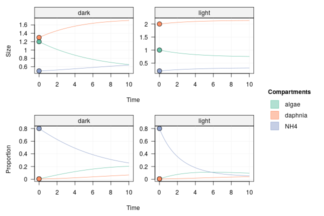
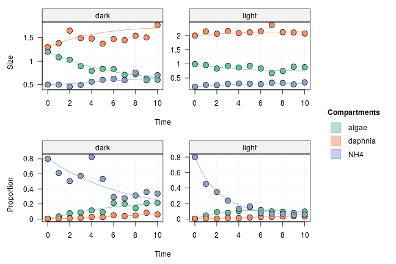
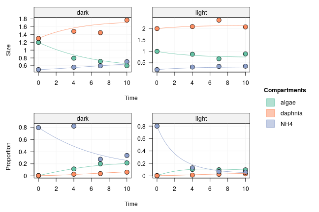

Simulating data is a good way to test an experimental design prior to running a costly experiment. The **isotracer** package provides some basic functionality to simulate data for a network model in which the true parameter values are given by the user.

In this vignette, you will learn:

- how to create a network model and set the "true" values for its parameters
- how to generate simulated data from this network
- how to use the simulated data to fit a model and try to capture the original parameter values.

By repeating those basic steps, one can test different assumptions on the real system under study and different experimental designs to decide on the most cost-effective approach for the real experiment to be run.


```r
library(isotracer)
library(tidyverse)
```

## Creating a network model

In this vignette, we will use the same example as in the [Including Fixed Effects of Covariates](tutorial-050-fixed-effects.html) tutorial. The modelled foodweb has three compartments:

- dissolved ammonium NH$_4^+$ (`NH4`), which is enriched in $^{15}$N at the
  beginning of the experiment
- planctonic algae which incorporate NH$_4^+$ (`algae`)
- *Daphnia* which graze on algae and excrete ammonium into the water.

The experiment is done in two aquariums, with one aquarium exposed to light while the other is kept in the dark.

### Building the network model

The first step is to build the network model structure. This is done in exactly the same way as in the previous vignettes: we have to specify the network topology, some initial values, and potentially some covariates.

Let's start with the topology:


```r
mod <- new_networkModel() %>%
    set_topo("NH4 -> algae -> daphnia -> NH4")
```

```
## Using default distribution family for proportions ("gamma_cv").
```

```
##   (eta is the coefficient of variation of gamma distributions.)
```

```
## Using default distribution family for sizes ("normal_cv").
```

```
##   (zeta is the coefficient of variation of normal distributions.)
```

We prepare a table of initial values which could be used in the real-life experiment we want to prepare:


```r
inits <- tibble::tribble(
     ~comps, ~sizes, ~props, ~treatment,
      "NH4",    0.2,    0.8,    "light",
    "algae",      1,  0.004,    "light",
  "daphnia",      2,  0.004,    "light",
      "NH4",    0.5,    0.8,     "dark",
    "algae",    1.2,  0.004,     "dark",
  "daphnia",    1.3,  0.004,     "dark")
```

We had the initial values to the model, and we indicate that we want to group initial values by `"treatment"`:


```r
mod <- set_init(mod, inits, comp = "comps", size = "sizes",
                prop = "props", group_by = "treatment")
mod
```

```
## # A tibble: 2 × 5
##   topology           initial          observations parameters       group    
##   <list>             <list>           <list>       <list>           <list>   
## 1 <topology [3 × 3]> <tibble [3 × 3]> <NULL>       <tibble [8 × 2]> <chr [1]>
## 2 <topology [3 × 3]> <tibble [3 × 3]> <NULL>       <tibble [8 × 2]> <chr [1]>
```

### Setting parameter values

We have the basic model ready to be given some "true" parameter values. What are the parameters we have to specify?


```r
params(mod)
```

```
## # A tibble: 8 × 2
##   in_model                 value
##   <chr>                    <dbl>
## 1 eta                         NA
## 2 lambda_algae                NA
## 3 lambda_daphnia              NA
## 4 lambda_NH4                  NA
## 5 upsilon_algae_to_daphnia    NA
## 6 upsilon_daphnia_to_NH4      NA
## 7 upsilon_NH4_to_algae        NA
## 8 zeta                        NA
```

Let's say that we want to simulate an effect of `"treatment"` (light/dark) on the uptake of NH4 by the algae:


```r
mod <- add_covariates(mod, upsilon_NH4_to_algae ~ treatment)
```

Now we have more parameters to specify:


```r
params(mod)
```

```
## # A tibble: 9 × 2
##   in_model                   value
##   <chr>                      <dbl>
## 1 eta                           NA
## 2 lambda_algae                  NA
## 3 lambda_daphnia                NA
## 4 lambda_NH4                    NA
## 5 upsilon_algae_to_daphnia      NA
## 6 upsilon_daphnia_to_NH4        NA
## 7 upsilon_NH4_to_algae|dark     NA
## 8 upsilon_NH4_to_algae|light    NA
## 9 zeta                          NA
```

We can set the parameter values with the `set_params()` function:


```r
mod <- mod %>%
  set_params(c("eta" = 0.2, "lambda_algae" = 0, "lambda_daphnia" = 0,
               "lambda_NH4" = 0, "upsilon_NH4_to_algae|light" = 0.3,
               "upsilon_NH4_to_algae|dark" = 0.1,
               "upsilon_algae_to_daphnia" = 0.13,
               "upsilon_daphnia_to_NH4" = 0.045, "zeta" = 0.1))
```

Once the parameter values are stored in the network model, they are visible in the `parameters` column:


```r
mod$parameters
```

```
## [[1]]
## # A tibble: 8 × 3
##   in_replicate             in_model                   value
##   <chr>                    <chr>                      <dbl>
## 1 eta                      eta                        0.2  
## 2 lambda_algae             lambda_algae               0    
## 3 lambda_daphnia           lambda_daphnia             0    
## 4 lambda_NH4               lambda_NH4                 0    
## 5 upsilon_algae_to_daphnia upsilon_algae_to_daphnia   0.13 
## 6 upsilon_daphnia_to_NH4   upsilon_daphnia_to_NH4     0.045
## 7 upsilon_NH4_to_algae     upsilon_NH4_to_algae|light 0.3  
## 8 zeta                     zeta                       0.1  
## 
## [[2]]
## # A tibble: 8 × 3
##   in_replicate             in_model                  value
##   <chr>                    <chr>                     <dbl>
## 1 eta                      eta                       0.2  
## 2 lambda_algae             lambda_algae              0    
## 3 lambda_daphnia           lambda_daphnia            0    
## 4 lambda_NH4               lambda_NH4                0    
## 5 upsilon_algae_to_daphnia upsilon_algae_to_daphnia  0.13 
## 6 upsilon_daphnia_to_NH4   upsilon_daphnia_to_NH4    0.045
## 7 upsilon_NH4_to_algae     upsilon_NH4_to_algae|dark 0.1  
## 8 zeta                     zeta                      0.1
```

The model is now complete and can be used to generate data!

## Generating simulated data

One can calculate predicted trajectories with the `project()` function:


```r
proj <- mod %>% project(end = 10)
plot(proj, facet_row = "type", facet_col = "group")
```



Real-life data will incorporate some variability around those trajectories. To simulate data with variability around expected compartment size (coefficient of variation `"zeta"`) and around expected proportion of tracer (c.v. `"eta"`), one can use the `sample_from()` function:


```r
spl <- mod %>% sample_from(at = 1:10)
spl
```

```
## # A tibble: 60 × 5
##     time comp   size   prop treatment
##    <dbl> <chr> <dbl>  <dbl> <chr>    
##  1     1 algae 0.958 0.0459 light    
##  2     2 algae 0.842 0.0895 light    
##  3     3 algae 0.930 0.0783 light    
##  4     4 algae 0.875 0.103  light    
##  5     5 algae 0.936 0.153  light    
##  6     6 algae 0.843 0.116  light    
##  7     7 algae 0.677 0.0982 light    
##  8     8 algae 0.750 0.0935 light    
##  9     9 algae 0.904 0.0775 light    
## 10    10 algae 0.888 0.0968 light    
## # … with 50 more rows
```

To visualize the simulated data, we can add it to the projected trajectories:


```r
proj <- proj %>%
  set_obs(spl, comp = "comp", size = "size", prop = "prop", time = "time",
          group = "treatment")
plot(proj, facet_row = "type", facet_col = "group")
```



## Fitting a model on the simulated data

We can use the simulated data in `spl` to fit parameters using MCMC. By using different versions of the dataset, we can compare different experimental designs. Here, to **test how sample size affects the uncertainty of parameter estimates**, we will perform MCMC runs with either the full `spl` dataset (ten time points) or a reduced dataset with only three time points:


```r
spl_reduced <- spl %>% filter(time %in% c(4, 7, 10))
```



### Run with ten time points

We add the simulated data to the model as we would do for real data:


```r
mod_full <- mod %>%
  set_obs(spl, comp = "comp", size = "size", prop = "prop", time = "time",
          group = "treatment")
```

We run the MCMC:


```r
run_full <- run_mcmc(mod_full, iter = 1000)
plot(run_full)
# Note: the figure below only shows a few of the traceplots for vignette concision
```


```
## Error in encode_priors(params_nm, priors_nm): One or several parameters are missing a prior.
## You can list the current model priors with `priors(...)`.
## You can list the missing model priors with `missing_priors(...)`.
```

```
## Error in plot(run_full[, 1:2]): object 'run_full' not found
```

and we do a posterior predictive check:


```r
pred_full <- predict(mod_full, run_full)
plot(pred_full, facet_row = c("group", "type"),
     facet_col = "compartment",
     scale = "all")
```


```
## Error in nrow(fit[[1]]): object 'run_full' not found
```

```
## Error in plot(pred_full, facet_row = c("group", "type"), facet_col = "compartment", : object 'pred_full' not found
```

### Run with three time points

We use the reduced dataset this time:


```r
mod_red <- mod %>%
  set_obs(spl_reduced, comp = "comp", size = "size", prop = "prop",
          time = "time", group = "treatment")
```

We run the MCMC:


```r
run_red <- run_mcmc(mod_red, iter = 1000)
plot(run_red)
# Note: the figure below only shows a few of the traceplots for vignette concision
```


```
## Error in encode_priors(params_nm, priors_nm): One or several parameters are missing a prior.
## You can list the current model priors with `priors(...)`.
## You can list the missing model priors with `missing_priors(...)`.
```

```
## Error in plot(run_red[, 1:2]): object 'run_red' not found
```

and we do a posterior predictive check:


```r
pred_red <- predict(mod_red, run_red)
plot(pred_red, facet_row = c("group", "type"),
     facet_col = "compartment",
     scale = "all")
```


```
## Error in nrow(fit[[1]]): object 'run_red' not found
```

```
## Error in plot(pred_red, facet_row = c("group", "type"), facet_col = "compartment", : object 'pred_red' not found
```

### Comparison

Does using ten time points (`spl`) instead of three (`spl_reduced`) improve a lot the parameter estimates? Let's compare the uncertainty in their posteriors:


```r
signif(summary(run_full)$quantiles, 2)
```

```
## Error in summary(run_full): object 'run_full' not found
```

```r
signif(summary(run_red)$quantiles, 2)
```

```
## Error in summary(run_red): object 'run_red' not found
```

For most parameters, it didn't change things much. **Maybe in this case an experiment with three time points would be sufficient.**

## To go further

This example only used one simulated dataset. When preparing a real-life experiment, it would make sense to try a range of "true" values for the parameters to be estimated and different initial conditions in addition to different experimental designs (number of replicates, number of samples, timing of sampling).

A convenient way to structure many data simulations is to create a tibble containing the simulation variables (e.g. parameter values, sampling points, alternative models) and store the resulting simulated datasets and their corresponding MCMC fits in list columns to make the analysis of the simulations easier.

<nav aria-label="Page navigation">
 <ul class="pagination justify-content-end">
  <li class="page-item"><a class="page-link" href="tutorial-110-derived-parameters.html">Previous: Calculating derived parameters</a></li>
  <li class="page-item"><a class="page-link" href="tutorial-130-parameter-identifiability.html">Next: Testing parameter identifiability</a></li>
 </ul>
</nav>
